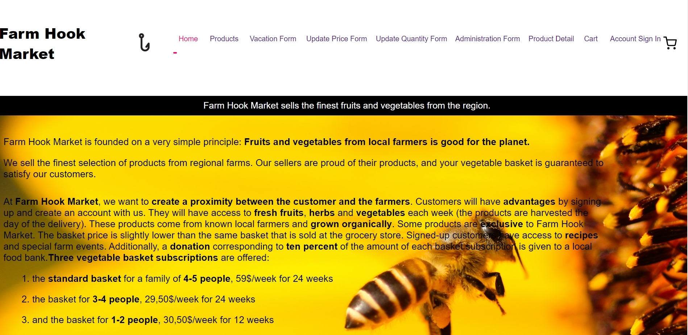

# Farm Hook Market

## Concordia Full-Stack Web Development Bootcamp - Final Project

E-commerce website where customers can buy a vegetable basket produced by local farmers.

## Features

### User / administrator login

It is possible to add extra vegetables individually or in addition to a subscribed vegetable basket
Possibility to leave a message online to change vegetable basket pick-up date if customer is on vacation
The administrator can update the quantity and the price of a product online

## Libraries/Languages Used

### Front-End:

React
React-Redux
React-Router
JavaScript
CSS
Styled-components

### Back-end:

Node.js
MongoDB
Express
Firebase
Productivity Tools
Git
GitHub

## Video Run-through

https://youtu.be/JHaNBCP0fL8
